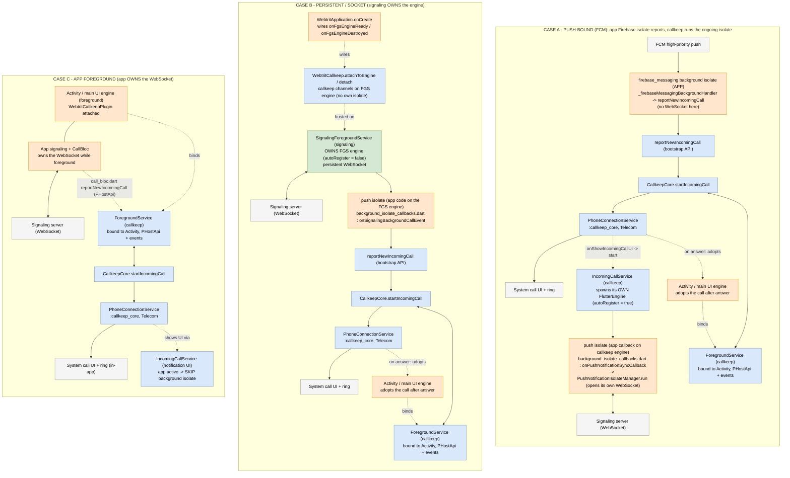
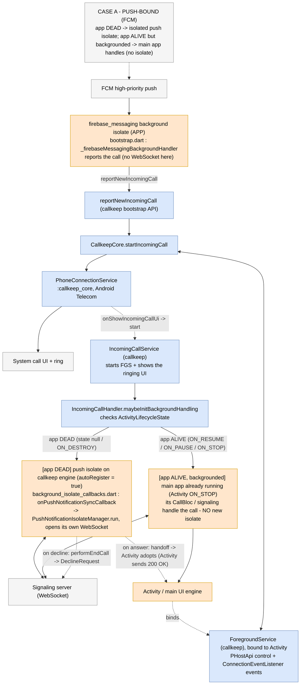
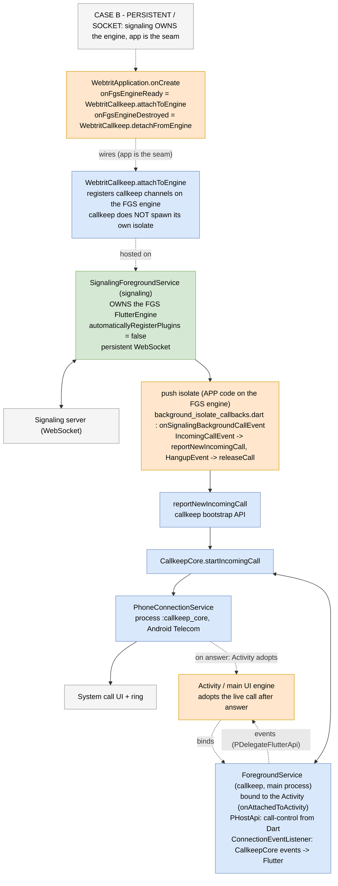
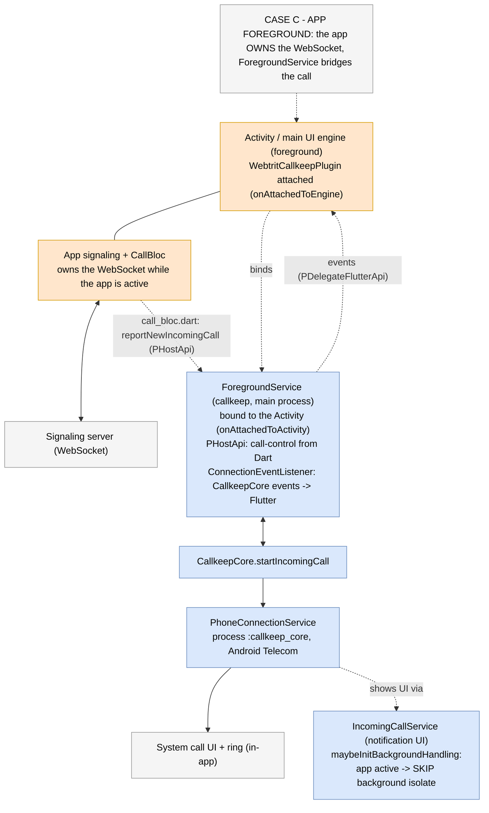
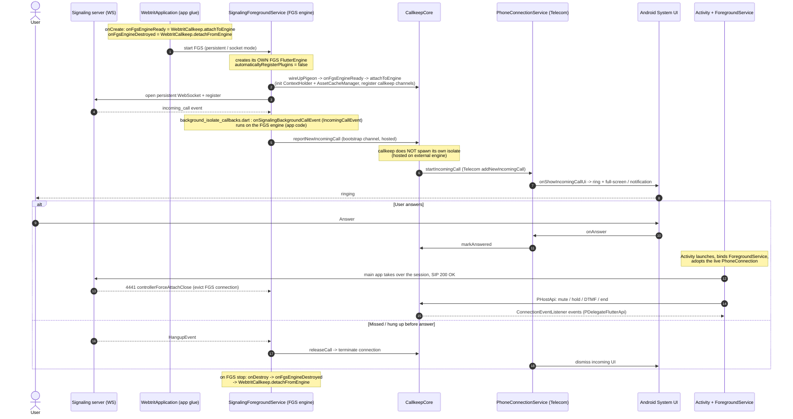

# Incoming-call background scenarios

How an incoming call is delivered and handled depending on the app state and the configured mode.
The single decision that selects the owner of the background work lives in callkeep
(`IncomingCallHandler.maybeInitBackgroundHandling`); see the callkeep doc
`webtrit_callkeep_android/docs/incoming-call-handling.md`. This page shows the app-level scenarios.

GitHub renders the `mermaid` blocks below.

Colour legend:

- blue — `webtrit_callkeep`
- green — `webtrit_signaling_service`
- orange — `webtrit_phone` (app code, incl. app callbacks running on a callkeep / FGS engine)
- grey — external (FCM, signaling server / WebSocket, Android Telecom / system UI)

## All scenarios (combined)



## Case A — push-bound (FCM)

App DEAD -> isolated push isolate; app ALIVE but backgrounded -> main app handles (no isolate).



## Case B — persistent / socket

Signaling owns the engine; the app is the seam (`WebtritCallkeep.attachToEngine`).



## Case C — app foreground

The app owns the WebSocket; `ForegroundService` bridges the call.



## Sequence — Case A (push-bound): answer / decline / missed

```mermaid
sequenceDiagram
    autonumber
    actor User
    participant WS as Signaling server (WS)
    participant FCM as FCM
    participant FMISO as Firebase isolate (app)
    participant CORE as CallkeepCore
    participant PCS as PhoneConnectionService (Telecom)
    participant SYS as Android System UI
    participant ICS as IncomingCallService (callkeep)
    participant PISO as push isolate (app callback)
    participant ACT as Activity + ForegroundService

    WS->>FCM: high-priority push (incoming call)
    FCM->>FMISO: deliver push
    Note over FMISO: bootstrap.dart : _firebaseMessagingBackgroundHandler<br/>reports the call (no WebSocket here)
    FMISO->>CORE: reportNewIncomingCall (bootstrap API)
    CORE->>PCS: startIncomingCall (Telecom addNewIncomingCall)
    PCS->>SYS: onShowIncomingCallUi -> ring + notification
    PCS->>ICS: start IncomingCallService (FGS)
    Note over ICS: spawns its OWN FlutterEngine (autoRegister = true)
    ICS->>PISO: executeDartCallback (app entrypoint)
    Note over PISO: background_isolate_callbacks.dart : onPushNotificationSyncCallback<br/>-> PushNotificationIsolateManager.run
    PISO->>WS: open its OWN WebSocket (ongoing call)
    SYS-->>User: ringing

    alt User answers
        User->>SYS: Answer
        SYS->>PCS: onAnswer
        PCS->>PISO: performAnswerCall (records _answeredCallId; no WS send)
        PISO->>ICS: handoffCall (stop service, keep connection)
        Note over ACT: Activity launches, binds ForegroundService, adopts the connection
        ACT->>WS: answer over the app WebSocket (SIP 200 OK)
        ACT->>CORE: PHostApi: mute / hold / DTMF / end
        CORE-->>ACT: ConnectionEventListener events (PDelegateFlutterApi)
        User->>ACT: Hang up -> SIP BYE
    else User declines
        User->>SYS: Decline
        SYS->>PCS: onReject -> terminateWithCause(REJECTED)
        PCS->>ICS: onDisconnect -> release(IC_RELEASE_WITH_DECLINE)
        ICS->>PISO: handleRelease(answered=false) -> performEndCall
        PISO->>WS: DeclineRequest (the push isolate sends the decline)
        Note over ICS: stop service, dismiss UI
    else Missed (caller cancels)
        WS-->>PISO: HangupEvent
        PISO->>CORE: releaseCall -> terminate connection
        PCS->>SYS: dismiss incoming UI
    end
```

## Sequence — Case B (persistent / socket)

> Caveat: the answer branch (Activity takeover, 200 OK, 4441 eviction) is the *intended* path,
> reconstructed from the documented 4441 / handoff mechanism. `onSignalingBackgroundCallEvent`
> itself only handles `IncomingCallEvent` (report) and `HangupEvent` (release); the persistent
> answer is the WT-1538 area.


