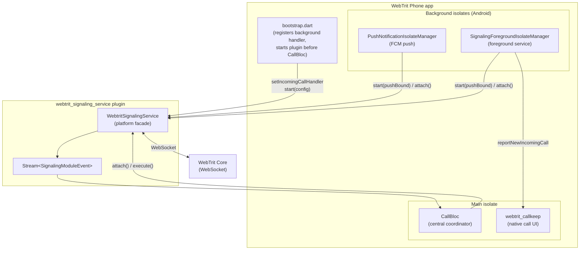

# Signaling Architecture

WebTrit Phone uses a standalone `webtrit_signaling_service` plugin to maintain a WebSocket
connection to WebTrit Core. The plugin abstracts all platform differences (iOS vs Android
background constraints) behind a single Dart API that `CallBloc` consumes identically on
both platforms.

**Plugin internals (layers, hub, modes, event model):**
→ [`packages/webtrit_signaling_service/ARCHITECTURE.md`](../packages/webtrit_signaling_service/ARCHITECTURE.md)

---

## Big picture



---

## Integration points

### 1. bootstrap.dart — startup sequence

```dart
// 1. Register background incoming-call handler (Android only, before start)
if (Platform.isAndroid) {
  await WebtritSignalingService().setIncomingCallHandler(onSignalingBackgroundIncomingCall);
}

// 2. Connect early — before CallBloc is built
//    Session replay buffer delivers events to late subscribers (CallBloc)
SignalingModule.connect();
```

### 2. CallBloc — the only consumer in the main isolate

`CallBloc` subscribes to `service.events` in its constructor and uses `execute()` to send
requests. It has no knowledge of isolates, hubs, foreground services, or platform channels.

```dart
_signalingSubscription = _signalingService.events.listen((event) {
  switch (event) {
    case SignalingConnected():
      add(const _SignalingClientEvent.connected());
    case SignalingHandshakeReceived(:final handshake):
      _handleHandshakeReceived(handshake);
    case SignalingProtocolEvent(:final event):
      _handleSignalingEvent(event);
    case SignalingConnectionFailed(:final isRepeated, :final recommendedReconnectDelay):
      if (!isRepeated) submitNotification(const SignalingConnectFailedNotification());
      _scheduleReconnect(recommendedReconnectDelay);
    case SignalingDisconnected(:final recommendedReconnectDelay):
      _scheduleReconnectIfNeeded(recommendedReconnectDelay);
    // ...
  }
});
```

Reconnect decision belongs to `CallBloc` — it checks app lifecycle, network state, and
active calls before calling `service.connect()`. The plugin only provides
`recommendedReconnectDelay` as a protocol hint (see
[ARCHITECTURE.md — Reconnect](../packages/webtrit_signaling_service/ARCHITECTURE.md#reconnect--who-decides-what)).

### 3. Push isolate (Android) — push-bound mode

```dart
// onPushNotificationSyncCallback — push isolate entry point
await WebtritSignalingService().start(config, mode: SignalingServiceMode.pushBound);
// service starts, WebSocket connects, IncomingCallEvent dispatched to callkeep
```

### 4. Activity opens after a push — attach

```dart
// main isolate, when Activity creates after a push-initiated call
await WebtritSignalingService().attach();
// connects to the already-running hub — no new WebSocket, no lost events
// CallBloc receives session buffer replay immediately
```

### 5. Background incoming call handler

When the service runs in `persistent` mode and the app is closed, incoming calls are
dispatched from the background isolate directly to Callkeep via a registered callback:

```dart
@pragma('vm:entry-point')
Future<void> onSignalingBackgroundIncomingCall(IncomingCallEvent event) async {
  await AndroidCallkeepServices.backgroundPushNotificationBootstrapService
      .reportNewIncomingCall(
        event.callId,
        CallkeepHandle.number(event.caller),
        displayName: event.callerDisplayName,
        hasVideo: JsepValue.fromOptional(event.jsep)?.hasVideo ?? false,
      );
}
```

---

## Platform difference (summary)

| | iOS | Android |
|-|-----|---------|
| Where socket runs | Main isolate | Background isolate (foreground service) |
| Survives app close | No | Yes (`persistent` mode) |
| Incoming call (app closed) | PushKit → CallBloc | Service dispatches to callback → Callkeep |
| `attach()` | No-op | Connects to running hub |
| `setIncomingCallHandler` | No-op | Resolves handle via `PluginUtilities` internally, persists to `SharedPreferences` |

---

## Related docs

| Document | What it covers |
|----------|---------------|
| [`packages/webtrit_signaling_service/ARCHITECTURE.md`](../packages/webtrit_signaling_service/ARCHITECTURE.md) | Plugin internals: three-layer model, hub, service modes, event model, session buffer |
| [`packages/webtrit_signaling_service/README.md`](../packages/webtrit_signaling_service/README.md) | Quick start, full API reference, mode lifecycle diagrams, Callkeep integration |
| [`docs/call_architecture.md`](call_architecture.md) | `CallBloc` responsibilities, event categories, state machine, isolate managers |
