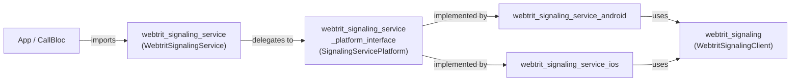
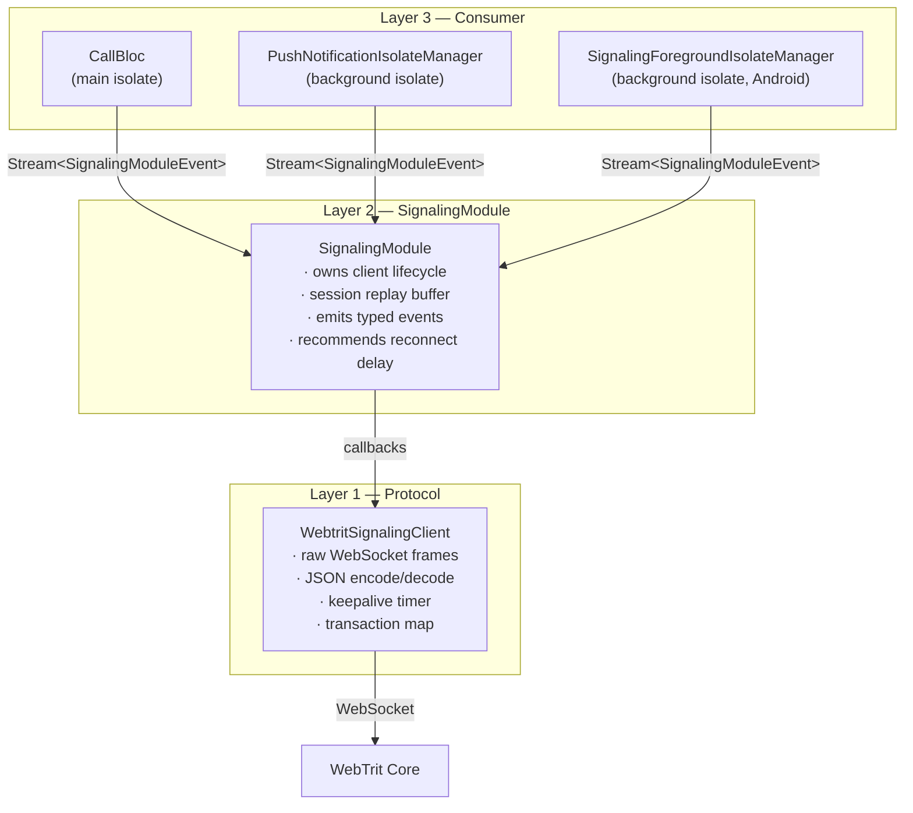
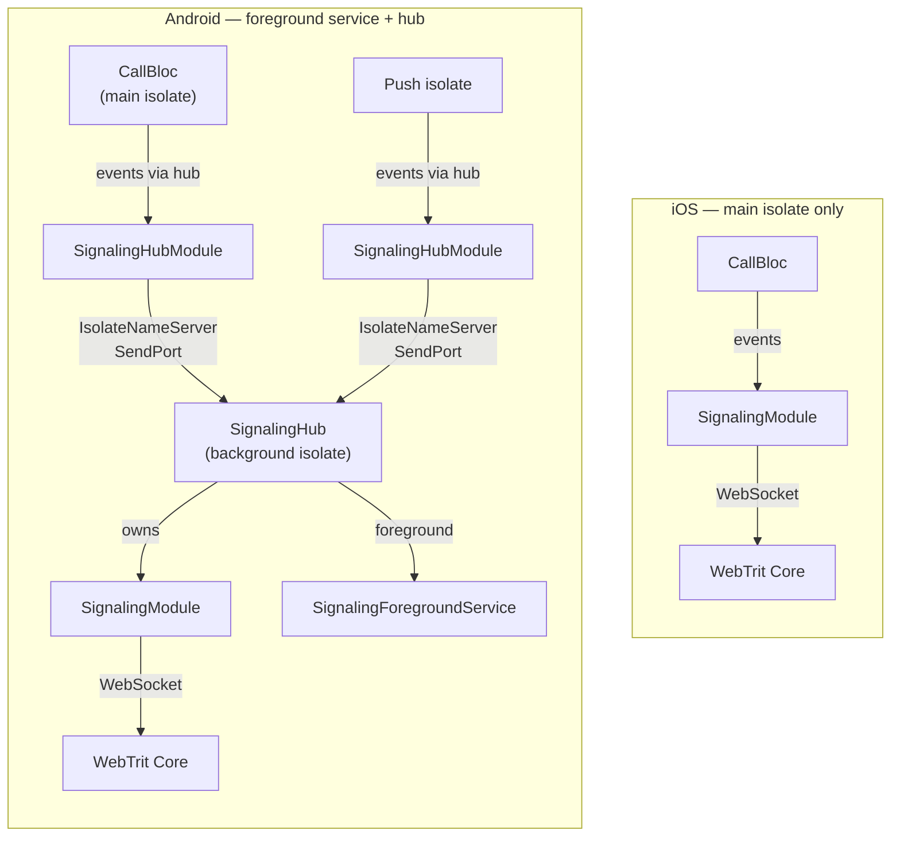
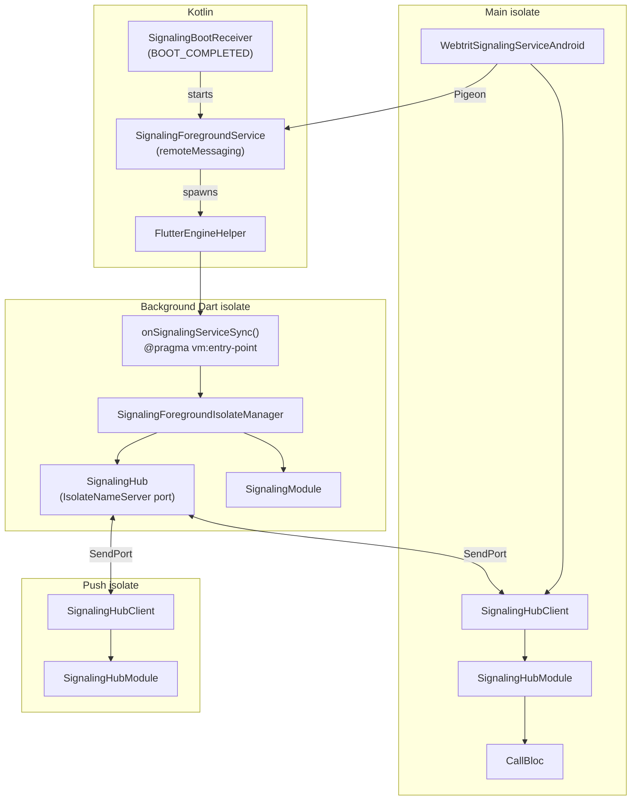
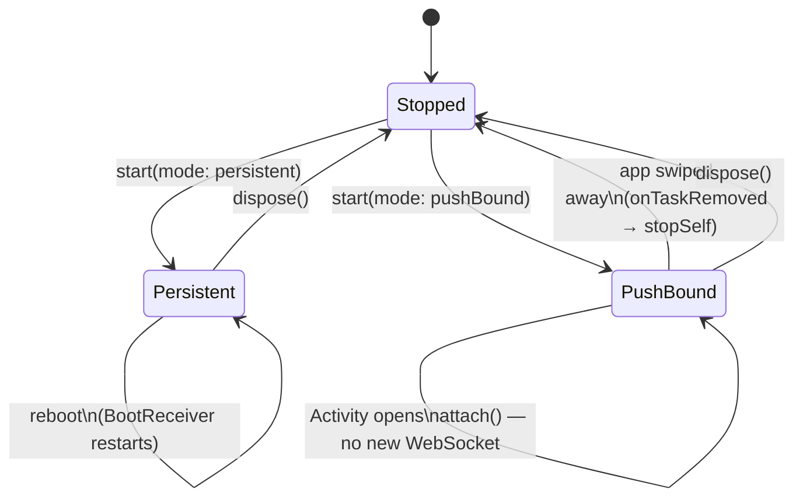
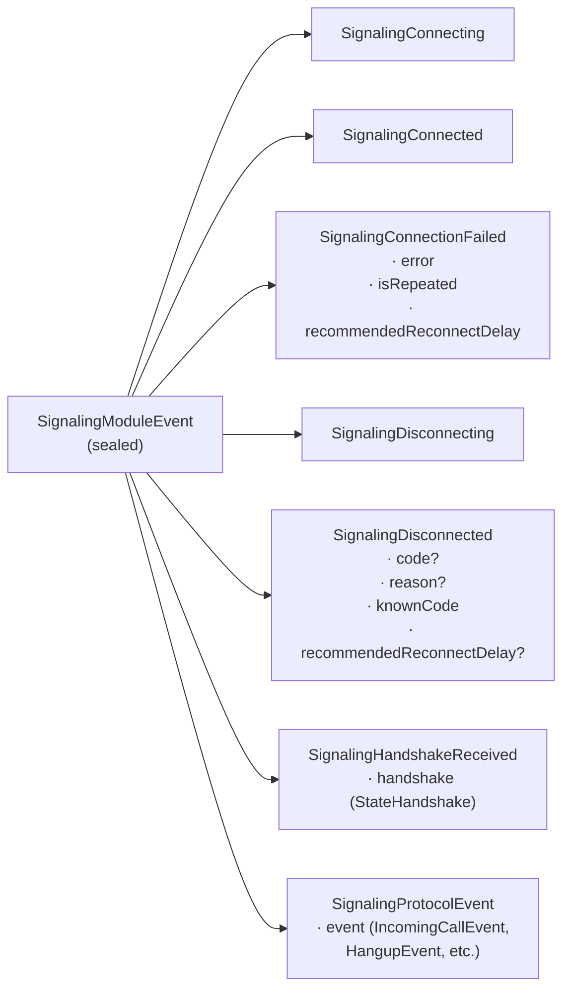
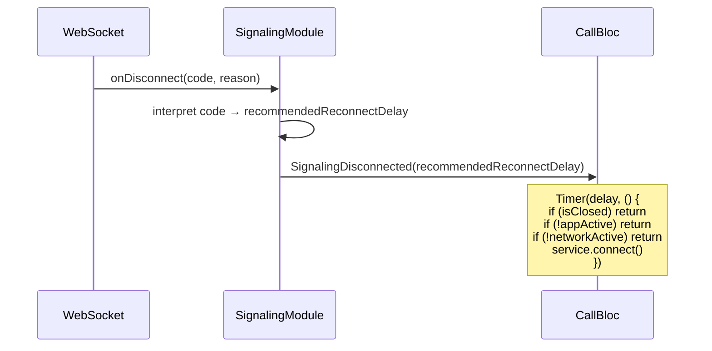

# webtrit_signaling_service — Architecture

> Plugin internals: layers, hub, isolates, modes, event model.
> For app-level integration see [
`docs/signaling_architecture_target.md`](../../docs/signaling_architecture_target.md).

---

## Package structure



---

## Three-layer model

Each layer knows only the one below it — never above.



| Layer                                | Knows                                                      | Does NOT know                                     |
|--------------------------------------|------------------------------------------------------------|---------------------------------------------------|
| `WebtritSignalingClient`             | Raw WebSocket, JSON protocol, transactions                 | App lifecycle, reconnect logic                    |
| `SignalingModule`                    | Disconnect codes, reconnect delay hints, session buffering | Network state, active calls, whether to reconnect |
| Consumer (CallBloc / IsolateManager) | App lifecycle, network, active calls                       | WebSocket internals                               |

---

## iOS vs Android



On iOS the socket lives in the main isolate and is recreated each time the app foregrounds.
On Android the socket lives in a background isolate inside a foreground service — it survives
app backgrounding and dispatches incoming calls when the app is closed.

---

## Android hub architecture



### Hub wire protocol (pure Dart ports — no platform channels)

| Direction    | Message                   | Description                                                 |
|--------------|---------------------------|-------------------------------------------------------------|
| Client → Hub | `{ sub, id, replyPort }`  | Subscribe; hub replies with ack then replays session buffer |
| Client → Hub | `{ unsub, id }`           | Unsubscribe                                                 |
| Client → Hub | `{ exec, id, corr, req }` | Execute request; hub replies `[result, corr, error?]`       |
| Hub → Client | `SignalingModuleEvent`    | Forwarded to every subscriber in real time                  |

### `attach()` sequence — why `awaitAck` comes before `start()`

```
awaitAck()   ← registers the internal Completer FIRST (before ack can arrive)
start()      ← sends {sub} to hub → hub sends sub-ack + session buffer replay
await ack    ← now safe to wait; ack arrives because start() already fired
```

Awaiting the future before `start()` always times out — `start()` is what triggers the ack.

---

## Service modes



|                     | `persistent`                                       | `pushBound`                                  |
|---------------------|----------------------------------------------------|----------------------------------------------|
| Survives app close  | Yes                                                | No — `onTaskRemoved` stops service           |
| Survives reboot     | Yes — `SignalingBootReceiver`                      | No                                           |
| Incoming calls      | WebSocket always live → direct `IncomingCallEvent` | Server sends FCM push (no active socket)     |
| When Activity opens | `attach()` — connects to running hub               | `attach()` — connects to hub started by push |
| `onStartCommand`    | `START_STICKY`                                     | `START_NOT_STICKY`                           |

---

## Event model



`recommendedReconnectDelay` in `SignalingDisconnected`:

| Value                  | Meaning                                                              |
|------------------------|----------------------------------------------------------------------|
| `Duration.zero`        | Reconnect immediately (code 4441 — server evicted duplicate session) |
| `Duration(seconds: 3)` | Standard slow reconnect                                              |
| `null`                 | Do not reconnect (protocol error)                                    |

---

## Session replay buffer

`connect()` is called in `initState()` — before `CallBloc` is built. When `CallBloc` subscribes
later it gets the full session history via the buffer:

```
MainShellState.initState()
  └─ SignalingModule.connect()

  buffered:  Connecting → Connected → HandshakeReceived(lines)

CallBloc constructed later:
  └─ service.events.listen(...)
       ├─ [replay] SignalingConnecting
       ├─ [replay] SignalingConnected
       ├─ [replay] SignalingHandshakeReceived
       └─ [live]   future events...
```

`connect()` clears the buffer — each reconnect starts fresh.
Both `SignalingModule` and `SignalingHubModule` maintain independent session buffers.

---

## Reconnect — who decides what



`SignalingModule` owns **protocol knowledge** (what the code means).
`CallBloc` owns **app context** (whether reconnect makes sense right now).

---

## Background incoming call handler (Android)

When the app is closed and the service runs in `persistent` mode, incoming calls arrive in
the background isolate. The plugin dispatches them via a registered Dart callback:

```
SignalingForegroundIsolateManager receives IncomingCallEvent
  └─ _dispatchIncomingCall(event)
       └─ PluginUtilities.getCallbackFromHandle(incomingCallHandlerHandle)
            └─ onSignalingBackgroundIncomingCall(event)   ← app-side
                 └─ callkeep.reportNewIncomingCall(...)
```

The callback must be a **top-level function** annotated `@pragma('vm:entry-point')`.
The plugin resolves the raw handle internally via `PluginUtilities.getCallbackHandle(callback)`
and persists it to `SharedPreferences`; the background isolate reads it at each sync —
the main isolate does not need to be alive.

---

## Key design decisions

| Question                                 | Decision               | Why                                                                                                                      |
|------------------------------------------|------------------------|--------------------------------------------------------------------------------------------------------------------------|
| `connect()` — Future or fire-and-forget? | Fire-and-forget        | Result arrives via stream; two channels for the same fact are redundant                                                  |
| Where does protocol knowledge live?      | `SignalingModule`      | Disconnect codes and delays are protocol detail, not app logic                                                           |
| Where does reconnect decision live?      | Consumer               | Only the consumer knows app state, network, and active calls                                                             |
| Session buffer — `rxdart` or manual?     | Manual `List`          | `ReplaySubject` has no `clear()` in v0.28; manual list gives full control                                                |
| `dispose()` closes the events stream?    | No                     | Closing would silently terminate active BLoC subscribers via `onDone`; stream stays open across `dispose`/`start` cycles |
| iOS background service?                  | No — main isolate only | iOS suspends background processes; no equivalent of Android foreground service                                           |
